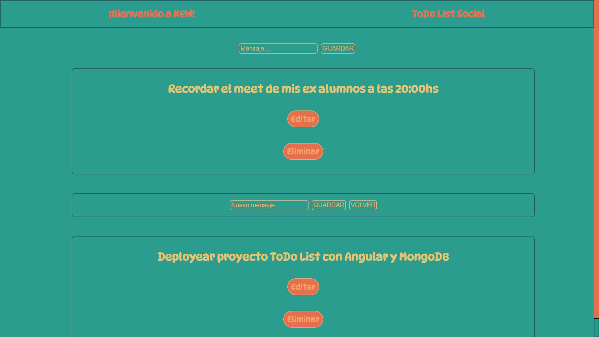

# NEW

Podras ejecutar este proyecto con los siguientes comandos en consola en ambas carpetas, `npm install` (instalar dependecias) luego `npm start` (levantar proyecto). 

### NEW es una todo list con CRUD.

### El cual podemos guardar, ver, editar y eliminar los mensajes.

